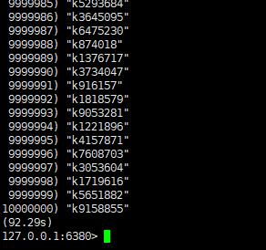
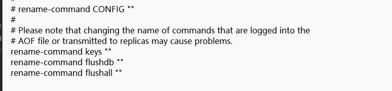
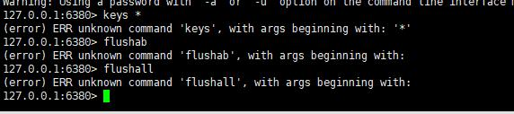
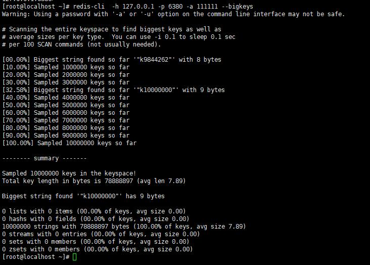
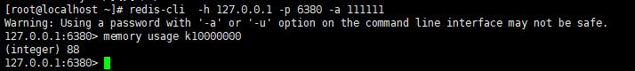

[[redis-bigkey]]
== BigKey

=== MoreKey 案例

我们来模拟一下 MoreKey 的问题，首先往 Redis 中插入千万或百万条数据，这里使用脚本生产 1000w 条数据的文本

[source,shell]
----
for((i =1;i<=1000*10000;i++)); do echo "set k$i v$i" >> /tmp/redidTest.txt;done;
----

通过 Redis 提供的管道 `--pipe` 命令插入 1000w 大批量数据

[source,shell]
----
cat /tmp/redidTest.txt | redis-cli -h 127.0.0.1 -p 6379 -a 111111 --pipe
----

我们使用 `keys *` 命令看看 1000w 条数据遍历需要花费多长时间

[IMPORTANT]
====
线上环境禁止使用 `keys *` ,`flushdb`,`flushall` 命令。因为 Redis 是单线程的，其所有的操作都是原子的，而 `keys *` 算法是遍历算法，复杂度为 O(n)，如果实例中有千万级以上的 key，这个指令就会导致 Redis
服务卡顿，所有读写的其他命令都会被延后或者超时，可能会引起缓存雪崩甚至数据库宕机。

通过配置文件设置禁用这些命令，在 `redis.conf` 中的 <<redis-conf-security>> 这一块配置。

====

我们可以使用 `scan` 命令来迭代数据库中的数据.scan 命令基本语法如下

[source,shell]
----
SCAN cursor [MATCH pattern] [COUNT count]
----

* cursor: 游标
* pattern：匹配的模式
* count：指定从数据集里返回多少个元素。默认值为 10

scan 是基于游标的迭代器，以 0 作为游标开始一次新的迭代，每次被调用后，都会向用户返回一个新的游标，用户在下次迭代时需要使用这个新的游标作为 SCAN 命令的游标参数，
直到命令返回游标 0 完成一次查询。

scan 不保证每次执行都返回某个给定数量的元素，支持模糊查询

scan 一次返回的数量不可控，只能是大概率符合 `count` 参数

[NOTE]
====
SCAN 的遍历顺序非常特别，他不是从第一维数组的第零位一直遍历到末尾，而是采用了高位进位加法来遍历。之所有使用这样特殊的方式进行遍历，是考虑到字典的扩容和缩容时避免槽位的遍历重复和遗漏。
====

=== BigKey

多大 key 算大 key::
阿里云规范中，string 类型控制在 10kb 以内，hash，list，set，zset 元素个数不超过 5000.非字符串的 bigkey，不要使用 del 删除，使用 hscan，ltrim，sscan，zscan 方式渐进式删除，同时，要注意防止
bigkey 过期时间自动删除问题（例如一个 200 万的 zset 设置 1 小时过期，会触发 del 操作，造成阻塞，而且该操作不会出现在慢查询中（latency 可查））

使用 `--bigkeys` 和 `memory usage`  来查询 bigkey。

==== BigKey 删除

* Hash 删除：hscan + hdel：

include::code:DeleteBigKey[tag=delBigKeyHash]

* List 删除：ltrim

include::code:DeleteBigKey[tag=delBigKeyList]

* Set 删除：sscan + srem

include::code:DeleteBigKey[tag=delBigKeySet]

* Zset 删除：zscan + zrem

include::code:DeleteBigKey[tag=delBigKeyZSet]

==== 生产调优

Redis 有两个原语来删除 key。一种称为 DEL，是对象的阻塞删除。这意味着服务器停止处理新命令，以便以同步方式回收与对象关联的所有内存。如果删除的键与一个小对象相关联，则执行 `DEL` 命令所需的
时间非常短，可与大多数其他命令相媲美（Redis 中的 O(1) 或 O(logn) 命令）。但是，如果键包含数百万个元素的聚合值相关联，则服务器可能会阻塞很长时间才能完成操作。

基于上述原因，Redis 还提供了非阻塞删除原语，例如 UNLIKE（非阻塞 DEL）以及 `FLUSHALL` 和 `FLUSHDB` 命令的 `ASYNC` 选项，以便在后台回收内存。这些命令在恒定时间内执行。另一个线程将尽可能
快的逐步释放后台中的对象。

`FLUSHALL` 和 `FLUSHDB` 的 `DEL`，`UNLIKE` 和 `ASYNC` 选项是用户控制的，这取决于应用程序的设计，以了解何时使用哪一个好，

配置惰性删除：

修改 `redis.conf` 中的 `lazyfree` 选项。常用是将以下三个改为 `yes`

[source,text]
----
lazyfree-lazy-server-del yes
replica-lazy-flush yes
lazyfree-lazy-user-del yes
----
