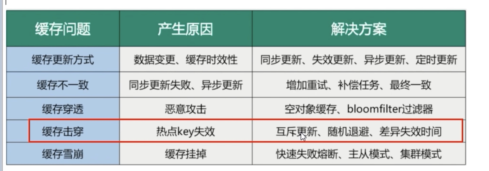

[[redis-cache]]
== 缓存预热，雪崩，穿透，击穿

=== 缓存预热

缓存预热是指在系统启动或进行大量读取操作之前，提前将常用的数据加载到缓存中，以减少后续请求的响应时间。通过缓存预热，可以避免冷启动时缓存没有命中的情况，提高系统的性能和响应速度。

具体来说，缓存预热可以通过一次性加载所有常用数据或者按需加载部分数据两种方式进行。一次性加载适用于数据量较小且访问频率较高的情况，而按需加载适用于数据量较大或者访问频率较低的情况。

缓存预热的好处包括减少数据库或其他数据源的访问压力，提高系统的并发能力，降低用户等待时间，改善用户体验。

需要注意的是，缓存预热应根据实际情况选择合适的时机和策略，避免过度预热导致资源浪费或者预热不足无法达到预期效果。

=== 缓存雪崩

缓存雪崩是指在缓存系统中，由于多个缓存键同时过期或缓存服务器集群发生故障，导致大量请求无法命中缓存，直接访问后端数据库或其他数据源，从而造成数据库负载过大或系统宕机的现象。

当缓存键过期或缓存服务器故障时，如果没有有效的容错机制，所有的请求都会直接落到后端数据库上，导致数据库压力骤增。当数据库无法承受如此大的负载时，系统响应变慢甚至崩溃，进一步影响整个系统的可用性。

为了避免缓存雪崩，可以采取以下一些预防措施：

1. 缓存数据的过期时间设置随机，避免同时过期。
2. 引入多级缓存架构，例如分布式缓存部署、本地缓存和全局缓存组合使用。
3. 实施缓存失效策略，即使缓存失效时，也能够通过容错机制保障系统的正常运行。
4. 监控缓存系统的状态，及时发现故障并进行修复和扩展。
5. 提前进行缓存预热，加载常用数据，避免在高峰期同时进行大量缓存加载。

通过以上措施的综合应用，可以有效预防和应对缓存雪崩问题，提升系统的稳定性和可靠性。

=== 缓存穿透

缓存穿透是指恶意请求或者非常罕见的请求（通常是一些不存在的数据），绕过缓存直接查询后端数据库或其他数据源。由于缓存无法命中这些请求，每次请求都需要查询后端系统，导致缓存系统的性能下降，并可能引起后端系统的过载。

具体而言，缓存穿透发生的典型场景是当用户请求一个不存在的数据时，如查询一个未被缓存的数据或者通过修改请求参数来绕过缓存。在这种情况下，缓存系统无法将数据缓存下来，每次请求都需要直接访问后端系统，造成性能损失。

为了防止缓存穿透，可以采取以下一些防御措施：

1. 输入合法性校验：在请求到达缓存层之前，对请求参数进行校验，过滤掉非法的、恶意的请求。
2. 布隆过滤器（Bloom Filter）：使用布隆过滤器来判断请求的数据是否存在于缓存中。布隆过滤器是一种快速且占用空间较小的数据结构，可以高效地判断某个元素是否存在于集合中，从而减少不必要的数据库查询。
3. 缓存空对象（Null Object Caching）：对于一些已知不存在的数据，可以在缓存中缓存一个空对象或特殊值，避免后续请求继续查询后端系统。
4. 设置缓存过期时间：为了防止过多的无效查询，可以为缓存设置一个合适的过期时间，避免频繁地访问后端系统。

通过以上的防御措施，可以有效预防和应对缓存穿透问题，提升系统的性能和安全性。

=== 缓存击穿

缓存击穿是指一个高并发的请求，针对一个特定的缓存键（Key）进行查询，但该缓存键刚好过期或者被淘汰，导致请求直接落到后端数据库或者其他数据源上，造成后端系统压力过大，影响系统的性能和可用性。

具体来说，当一个缓存键失效后，如果有大量请求同时访问这个缓存键，而缓存系统还没有来得及更新缓存，这些请求将直接访问后端数据库或数据源，导致数据库负载急剧升高，甚至引起性能问题或系统崩溃。

为了防止缓存击穿，可以采取以下一些防御措施：

1. 缓存永不过期：对于对系统重要的数据，可以设置缓存永不过期，确保即使缓存失效，也能从后端系统加载最新数据。
2. 引入互斥锁（Mutex Lock）：在缓存失效时，只允许一个请求去更新缓存，其他请求等待并使用互斥锁保证并发访问的安全性。
3. 异步更新缓存：后台线程或异步任务可以在缓存失效之前主动更新缓存，避免多个请求同时访问失效的缓存键。
4. 延时失效：在缓存过期前，延迟缓存的失效时间，以便在高并发时让部分请求能够同时命中缓存，减轻后端压力。
5. 限流或熔断：对于过多请求直接访问后端的情况，可以采用限流或熔断机制，控制请求的并发量，避免后端系统被过载。

通过上述措施的实施，可以有效预防和应对缓存击穿问题，保障系统的稳定性和可用性。

总结

