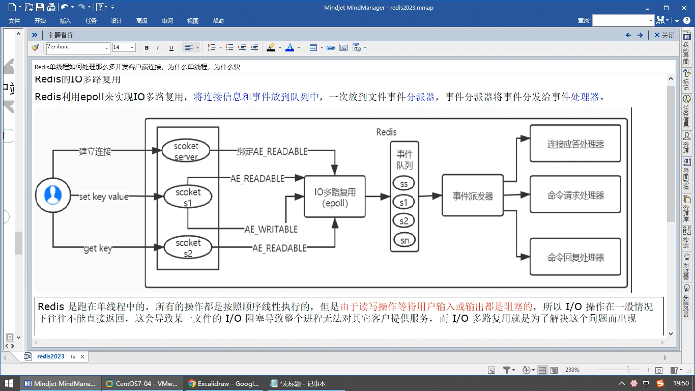

== epoll 和 多路复用模型

Redis 使用了多路复用技术来提高网络 IO 的效率，从而支持高并发的请求处理。

多路复用通过同一个线程监控和处理多个网络连接，将多个 I/O 事件统一管理和调度，避免了每个连接使用一个独立的线程或进程造成的资源浪费。在 Redis 中，多路复用主要通过以下两种机制实现：

1. select/poll/epoll：这些是一种基于事件驱动的 I/O 复用模型。Redis 在不同的操作系统上使用不同的底层实现，比如 select 在 Windows，poll 在大多数类 UNIX 系统上，epoll 在 Linux 上。通过这些机制，Redis 可以同时监控多个连接的读写事件，在有事件发生时进行响应处理。

2. 非阻塞 I/O：Redis 将网络连接设置为非阻塞模式，这意味着当 Redis 通过多路复用等待事件时，不会因为任何一个连接的 I/O 操作而阻塞。通过非阻塞 I/O，Redis 可以在等待事件期间继续处理其他任务，提高了事件处理的效率。

使用多路复用技术，Redis 能够高效地处理大量的并发请求。Redis 数据库服务器本身是单线程的，通过多路复用将多个连接的 I/O 事件合理调度，可以同时读取和写入多个连接，提高并发处理的能力。

需要注意的是，多路复用虽然可以提高 Redis 的并发性能，但在面对大量连接和高频率请求的情况下，仍然可能成为 Redis 性能的瓶颈。此时，可以通过搭建 Redis 集群、优化网络和硬件设置等方式进一步提升性能。

redis 单线程如何处理多并发客户端连接，为什么单线程，为什么那么块

=== 文件事件

Redis 基于 Reactor 模式开发了自己的网络事件处理器，这个处理器被称为文件事件处理器

* 文件事件处理器使用 I/O 多路复用程序来同时监听多个套接字，并根据套接字目前执行的任务来为套接字关联不同的文件事件处理器
* 当被监听的套接字准备好执行连接应答（accept），读取（read） 写入（write），关闭（close）等操作时，与操作相对应的文件事件就会产生，这时文件事件
处理器就会调用套接字之前关联好的事件处理器来处理这些事件

虽然文件事件处理器以单线程的方式运行，但通过使用 I/O 多路复用程序监听多个套接字，文件事件处理器即实现了高性能的网络通讯模型，又可以很好的与 Redis
服务器中其他同样以单线程方式运行的模块进行对接，这保证了 Redis 内部单线程设计的简单性。

=== Unix 网络编程中的五种 IO 模型

先了解几个概念：

* 同步：调用者要一直等待调用结果的通知后才能进行后续的执行，现在就要，我可以等，等处结果为止
* 异步：指被调用者先返回应答让调用者先回去，然后在计算调用结果，计算完结果后再通知并返回给调用者。异步调用一般想要获得结果一般通过回调。
* 阻塞：调用方一直在等待而且不做任何事，当前进程/线程会被挂起，啥都不干
* 非阻塞：调用在发出去后，调用方先去忙别的事情，不会阻塞当前进程/线程，而会立即返回

同步，异步讨论的对象一般是被调用者（服务提供者），重点在于获得调用结果的消息的通知方式上。
阻塞，非阻塞讨论的对象一般是调用者（服务请求者），重点在于等消息时候的行为，调用者是否能干其他事。

在 Unix 网络编程中，五种常见的 I/O 模型（也称为 I/O 多路复用模型）如下：

1. 阻塞式 I/O (Blocking I/O)：在阻塞式 I/O 模型中，当应用程序发起一个 I/O 操作时，它将一直阻塞（即停止执行）直到操作完成。这意味着直到 I/O 操作完成之前，程序不能继续执行其他任务。这是最简单的模型，但在面对大量的连接和并发请求时，可能导致性能问题。
2. 非阻塞式 I/O (Non-blocking I/O)：非阻塞式 I/O 模型中，当应用程序发起一个 I/O 操作后，它可以继续执行其他任务，而不需要等待 I/O 操作的完成。应用程序可以通过轮询或者查询 I/O 的状态，来判断 I/O 操作是否完成，如果还未完成则继续轮询。这种模型需要应用程序进行主动的轮询检查，可能导致 CPU 的资源浪费。
3. I/O 复用（Multiplexing）：I/O 复用模型使用特定的系统调用（如 select、poll、epoll 等）来同时监听多个 I/O 事件。这种模型允许应用程序在等待多个 I/O 事件的过程中继续执行其他任务，只在有事件发生时才会被唤醒。这有效地减少了 CPU 资源的浪费，并提高了并发能力。
4. 信号驱动式 I/O（Signal-Driven I/O）：信号驱动式 I/O 模型中，应用程序通过指定当某个 I/O 事件发生时，操作系统向应用程序发送一个信号。应用程序可以在信号处理函数中对事件进行处理。这种模型比较复杂，且信号处理函数需要与应用程序主循环配合来处理信号和数据，但相对于非阻塞和阻塞模型，可以减少轮询检查 I/O 状态的开销。
5. 异步 I/O：异步 I/O 模型中，应用程序通过发起一个 I/O 操作后立即返回，并提供一个回调函数或者事件来处理 I/O 操作完成后的通知。操作系统负责在 I/O 操作完成后主动调用回调函数来通知应用程序。这种模型使得应用程序可以处理多个同时进行的 I/O 操作，且不需要进行轮询检查。异步 I/O 是最高效的模型，但实现起来更为复杂，需要操作系统提供对应的支持。

每种模型都有其适用的场景，合理选择适合的 I/O 模型可以提高性能和并发能力，根据实际需求选择合适的模型很重要。

==== select

[source,text]
----
int select(
    int nfds,// 监控的文件描述符集里最大文件描述符加1
    fd_set *restrict readfds, //监控有读数据到达文件描述符集合，传入传出参数
    fd_set *restrict writefds, //监控有写数据到达文件描述符集合，传入传出参数
    fd_set *restrict errorfds, //监控异常发生到达文件描述符集合，传入传出参数
    struct timeval timeout // 定时阻塞监控时间，分三种情况。1、NULL：永远等下去，2、设置 timeval， 等待固定时间。3、设置 timeval 里时间都是 0，检查描述字后立即返回，轮询。
);
----

select 函数监视的文件描述符有三类，分别是 readfds，writefds，errorfds。将用户传入的数组拷贝到内核空间。

调用 select 函数后会阻塞，直到有描述符就绪（有可读，可写，或者异常）或超时（timeout 指定等待时间，如果立即返回设置为 null 即可），函数返回

当 select 函数返回后，可以通过遍历 fdset，来找到就绪的描述符。

select 是一种 I/O 多路复用模型，用于在多个文件描述符上进行监听，监测文件描述符的状态并等待其中任意一个文件描述符就绪。

执行过程：

1. 创建并初始化文件描述符集合（fd_set），将需要监听的文件描述符添加到集合中。
2. 调用 select 函数，传入需要监听的文件描述符集合以及其他参数（超时时间等）。
3. select 函数开始阻塞，等待文件描述符集合中的任意一个文件描述符准备就绪（可读、可写或异常）。
4. 当有文件描述符准备就绪时，select 函数返回，应用程序可以通过遍历文件描述符集合来判断哪些文件描述符就绪。
5. 根据返回的就绪文件描述符，执行相应的 I/O 操作。

优点：

1. 简易性：select 是传统的 I/O 多路复用模型，相对于其他模型，其接口相对简单易学。
2. 兼容性：select 在几乎所有的平台上都有实现，可以广泛应用于不同的系统。
3. 跨平台：由于 select 是 C 语言标准库提供的，因此能够跨平台运行，具有很好的可移植性。

缺点：

1. bitmap 最大 1024 位，一个进程最多只能处理 1024 个客户端。
2. 扩展性：select 模型在大量连接的高并发环境中，性能较差。随着文件描述符数量的增加，select 函数的性能会逐渐降低。
3. 动态性：使用 select 模型时，一旦文件描述符集合被固定，就不能动态地添加或删除文件描述符。每次调用 select 函数都需要重新设置文件描述符集合。
4. select 并没有通知用户态哪一个 socket 有数据，仍然需要 O(n) 遍历，select 仅返回可读文件描述符的个数，具体那个可读还是需要自己遍历。

select 模型适用于连接数较少且简单的应用场景，例如简单的服务器或者客户端程序。对于大规模并发的网络应用，更适合使用其他更高效的 I/O 多路复用模型（如 epoll、kqueue 等）来获得更好的性能。

==== poll

[source,text]
----
struct pollfd {
    int    fd;       /* file descriptor */
    short  events;   /* events to look for */
    short  revents;  /* events returned */
};
----

poll 是一种 I/O 多路复用模型，类似于 select，用于在多个文件描述符上进行监听，监测文件描述符的状态并等待其中任意一个文件描述符就绪。

执行流程：

1. 创建并初始化结构体数组（struct pollfd），每个结构体包含一个文件描述符以及要监听的事件类型。
2. 调用 poll 函数，传入结构体数组的地址以及其他参数（超时时间等）。
3. poll 函数开始阻塞，等待任意一个文件描述符就绪。
4. 当有文件描述符就绪时，poll 函数返回，应用程序可以通过遍历结构体数组来查找哪些文件描述符就绪。
5. 根据返回的就绪文件描述符，执行相应的 I/O 操作。

优点：

1. 简化编程：相比于 select，poll 提供了更简单和直观的接口。
2. 大规模连接支持：相比于 select，poll 可以支持更多的文件描述符，因为它使用了结构体数组而不是位图。

缺点：

1. 线性扫描：poll 需要遍历整个结构体数组来查找就绪的文件描述符，当文件描述符数量增加时，性能会退化，因为它需要线性扫描整个数组。
2. 慢速设备问题：当部分文件描述符处于慢速设备（如磁盘）的时候，poll 可能会造成不必要的性能损失，因为它需要等待所有描述符都就绪才会返回。

poll 模型适用于连接数较少且简单的应用场景，它相较于 select 具有更好的可扩展性，但在面对大规模并发连接和高并发请求时，性能可能不如其他更高级的 I/O 多路复用模型（如 epoll、kqueue）等。因此，在需要处理大量连接和高并发的场景下，应该优先考虑使用更高效的多路复用模型。

==== epoll

epoll 操作过程需要以下三个函数

[source,text]
----
// 参数 size 并不是限制了 epoll 所能监听的描述符的最大个数，只是对内核初始分配内部数据结构的一个建议
int epoll_create(int size)

int epoll_ctl(int epfd // epoll_create 的返回值
            int op //表示 op 操作，用三个宏来表示，添加：EPOLL_CTL_ADD，删除：EPOLL_CTL_DEL，修改：EPOLL_CTL_MOD。三操作对 fd 监听
            int fd // 需要监听的 fd
            struct epoll_event * event // 告诉内核要监听什么事
)

// 等待 epfd 上的 io 事件，最多返回 maxevents 个事件，参数 event 用来从内核中得到事件的集合，maxevents 告知内核这个 events 有多大。
int epoll_wait(
    int epfd
    struct epoll_event * event
    int maxevents
    int timeout
)
----

epoll 是一种高性能的 I/O 多路复用模型，用于在多个文件描述符上进行监听，监测文件描述符的状态并等待其中任意一个文件描述符就绪。在 Linux 系统下，epoll 是最常用的 I/O 多路复用模型。

执行流程：

1. 创建一个 epoll 实例（通过调用 epoll_create、epoll_create1 等函数）。
2. 将需要监听的文件描述符添加到 epoll 实例的事件集合中，并指定监听的事件类型（如可读、可写等）。
3. 调用 epoll_wait 函数，等待文件描述符就绪。
4. 当有文件描述符就绪时，epoll_wait 函数返回就绪的文件描述符及就绪的事件类型。
5. 根据返回的就绪文件描述符，执行相应的 I/O 操作。

优点：

1. 高性能：epoll 采用了事件驱动的方式，相比于传统的阻塞和非阻塞模型，可以避免不必要的轮询和线性扫描，提高了效率和并发能力。
2. 高扩展性：epoll 支持大规模并发连接，通过一个事件表维护大量的文件描述符和事件状态，对于成百上千的连接也能保持较好的性能。
3. 内核支持：epoll 是 Linux 内核提供的机制，在内核层面进行事件的管理和处理，可以利用操作系统底层的优化。

缺点：

1. 复杂性：相较于传统的阻塞和非阻塞模型，epoll 在编程上要求更高，使用起来较为复杂，需要结合多线程或异步编程等技术来处理并发情况。
2. 平台限定：epoll 是针对 Linux 系统的特定实现，不同平台上的实现机制可能有所不同，因此在跨平台时需要注意。
3. 内存占用：epoll 使用事件表来存储所有的文件描述符及其对应的事件状态，对于大量的并发连接，可能需要消耗较大的内存。

总的来说，epoll 是目前较为常用且高效的 I/O 多路复用模型，适用于需要处理大量并发连接的场景，特别是在高性能服务器应用中被广泛应用。

==== kqueue

kqueue 是一种高性能的 I/O 多路复用模型，用于在多个文件描述符上进行监听，监测文件描述符的状态并等待其中任意一个文件描述符就绪。它是在 BSD 系统上提供的一种机制。

执行流程：
1. 创建一个 kqueue 实例（通过调用 kqueue 函数）。
2. 使用 kevent 结构体注册需要监听的文件描述符以及关注的事件类型，描述符和事件类型被组织在 kevent 结构体中。
3. 调用 kevent 函数，等待文件描述符就绪。
4. 当有文件描述符就绪时，kevent 函数返回就绪的文件描述符及就绪的事件类型。
5. 根据返回的就绪文件描述符，执行相应的 I/O 操作。

优点：
1. 高性能：kqueue 采用了事件驱动的方式，能够高效地处理大规模并发连接，避免了不必要的轮询和线性扫描。
2. 高扩展性：kqueue 还能够监听其他事件，如进程信号、定时器等，因此在综合的事件驱动编程中具备更强的扩展性。
3. 更丰富的事件类型：kqueue 支持多种事件类型，可以在一个 kqueue 实例中注册多个文件描述符和多个不同的事件类型，灵活性更高。

缺点：
1. 平台限定：kqueue 是 BSD 系统的特定实现，只能在支持 kqueue 的系统上使用，不适用于所有平台。
2. 复杂性：相对于阻塞和非阻塞模型，kqueue 的编程复杂度较高，需要熟悉其特定的接口和使用方法。
3. 兼容性：不同平台上的 kqueue 实现可能有所不同，因此在跨平台时需要注意兼容性问题。

总的来说，kqueue 是一种高性能、扩展性强的 I/O 多路复用模型，适用于需要处理大量并发连接和其他事件类型的场景，特别是在 BSD 系统上被广泛应用。

==== 对比

|===
|  | select  | poll  | epoll

| 操作方式
| 遍历
| 遍历
| 回调

| 数据结构
| bitmap
| 数组
| 红黑树

| 最大连接数
| 1024（x86） 或 2048（x64）
| 无上限
| 无上限

| 最大支持文件描述符数
| 一般有最大值限制
| 65535
| 65535

| fd 拷贝
| 每次调用 select，都需要把 fd 集合从用户态拷贝到内核态
| 每次调用 poll，都需要把 fd 集合从用户态拷贝到内核态
| fd 首次调用 epoll_ctl 拷贝，每次调用 epoll_wait 不拷贝

| 工作效率
| 每次调用都进行线性遍历，时间复杂度为 O(n)
| 每次调用都进行线性遍历，时间复杂度为 O(n)
| 事件通知方式，每当 fd 就绪，系统注册的回调函数就会被调用，将就绪 fd 放到 readyList 里面，时间复杂度为 O(1)
|===
