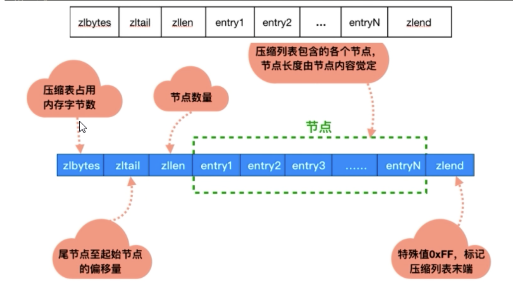
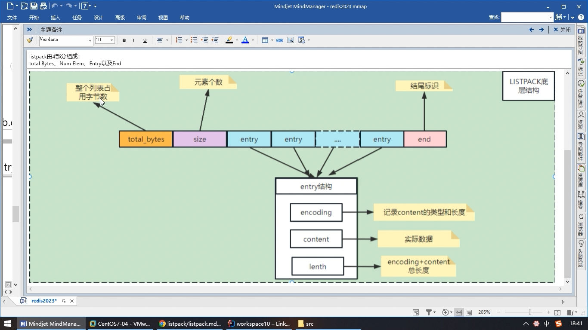

== 源码分析

数据类型和数据结构映射如下。关于类型和数据结构的定义可以在 `server.h` 中找到

. redis6 之前
|===
| type | encoding

| OBJ_STRING(0)
| OBJ_ENCODING_RAW(0),OBJ_ENCODING_INT(1)

| OBJ_LIST(1)
| OBJ_ENCODING_LINKEDLIST(4) 双端链表,OBJ_ENCODING_ZIPLIST(5) 压缩列表

| OBJ_SET(2)
| OBJ_ENCODING_HT(2) 字典, OBJ_ENCODING_INTSET(1) 整数集合

| OBJ_ZSET(3)
| OBJ_ENCODING_SKIPLIST(0) 跳跃表, OBJ_ENCODING_ZIPLIST(5) 压缩列表

| OBJ_HASH(4)
| OBJ_ENCODING_HT(2) 字典,OBJ_ENCODING_ZIPLIST(5) 压缩列表
|===

在 Redis 7 之后，OBJ_ENCODING_ZIPLIST（压缩列表）和 OBJ_ENCODING_LINKEDLIST（双端链表）不再使用，所有对应关系也有变化，
使用新的数据结构 ListPack 来替代 ZipList，在 7.0 版本已经没有 ZipList 的配置了，6.0 版本仅部分数据类型作为过度阶段使用，ListPack 已经替代了 ZipList 类似的
hash-max-ziplist-entries 配置。

. redis7 之后
|===
| type | encoding

| OBJ_STRING(0)
| OBJ_ENCODING_RAW(0),OBJ_ENCODING_INT(1)

| OBJ_LIST(1)
| OBJ_ENCODING_QUICKLIST(9) 快速列表

| OBJ_SET(2)
| OBJ_ENCODING_HT(2) 字典, OBJ_ENCODING_INTSET(1) 整数集合

| OBJ_ZSET(3)
| OBJ_ENCODING_SKIPLIST(0) 跳跃表, OBJ_ENCODING_LISTPACK(11) 紧凑列表

| OBJ_HASH(4)
| OBJ_ENCODING_HT(2) 字典,OBJ_ENCODING_LISTPACK(11) 紧凑列表
|===

Redis 中每一个对象都是一个 `redisObject` 结构，每个键值对都会有一个 `dictEntry`，源码在 `dict.h` 和 `dict.c` 文件中定义,这是一个结构体

.dict.c
[source,text]
----
struct dictEntry {
    void *key;
    union {
        void *val;
        uint64_t u64;
        int64_t s64;
        double d;
    } v;
    struct dictEntry *next;     /* Next entry in the same hash bucket. */
    void *metadata[];           /* An arbitrary number of bytes (starting at a
                                 * pointer-aligned address) of size as returned
                                 * by dictType's dictEntryMetadataBytes(). */
};
----

`dictEntry` 表示哈希表节点的结构，存放了 `void *key` 和 `void *value` 指针，`*key` 指向 String 对象，`*value` 既能指向 String 类型的对象，也能指向
集合类型的对象，例如（List + Hash + Set + ZSet 对象），`next` 指向下一个 `dictEntry`。

key 是字符串，但是 Redis 并没有直接使用 c 的字符数组，而是存储在 Redis 自定义的 SDS 中。value 既不是直接作为字符串存储，也不是直接存储在 SDS 中，而是存储在 `redisObject` 中。

NOTE: `void *key` 和 `void *value` 指向的是 Redis 内部抽象的对象，Redis 中的每个对象都由 `redisObject` 构成。实际上 Redis 常用的五种数据类型的任何一种，都是通过 `redisObject` 存储的。`redisObject` 对象在 server.h 文件中定义，如下

.server.h
[source,text]
----
struct redisObject {
    unsigned type:4;
    unsigned encoding:4;
    unsigned lru:LRU_BITS; /* LRU time (relative to global lru_clock) or
                            * LFU data (least significant 8 bits frequency
                            * and most significant 16 bits access time). */
    int refcount;
    void *ptr;
};
----

为了便于操作，Redis 使用了 `redisObject` 结构来统一五种不同的数据类型，这样所有的数据类型都可以以相同的形式在函数间传递而不用使用特定的类型结构。同时，为了区别不同的数据类型，Redis 引入了 `type` 和 `encoding`
字段对不同的数据类型加以区分。简单来说，`redisObject` 就是 `string`,`list`,`set`,`zset`,`hash` 的父类，可以在函数传递时隐藏具体的类型信息。

其中

* `type`： 表示对象的类型（OBJ_STRING(0)，OBJ_LIST(1)，OBJ_SET(2)，OBJ_ZSET(3)，OBJ_HASH(4)），
* `encoding`： 代表物理编码方式，也就具体的数据结构，同一种数据类型，其编码方式也可能不同
* `lru`：24 位，对象最后一次被命令程序访问的时间，与内存回收有关
* `refcount`： 代表引用次数，当 `refcount` 为 0 时，表示该对象已经不被任何对象引用，则可以进行内存回收了。
* `*ptr` 指向对象实际的数据类型。

=== String 数据结构

在介绍 String 类型之前，我们需要先了解一下什么是 SDS

我们来看看他的实现

[source,text]
====
----
/* Note: sdshdr5 is never used, we just access the flags byte directly.
 * However is here to document the layout of type 5 SDS strings. */
struct __attribute__ ((__packed__)) sdshdr5 {
    unsigned char flags; /* 3 lsb of type, and 5 msb of string length */
    char buf[];
};
struct __attribute__ ((__packed__)) sdshdr8 {
    uint8_t len; /* used */
    uint8_t alloc; /* excluding the header and null terminator */
    unsigned char flags; /* 3 lsb of type, 5 unused bits */
    char buf[];
};
struct __attribute__ ((__packed__)) sdshdr16 {
    uint16_t len; /* used */
    uint16_t alloc; /* excluding the header and null terminator */
    unsigned char flags; /* 3 lsb of type, 5 unused bits */
    char buf[];
};
struct __attribute__ ((__packed__)) sdshdr32 {
    uint32_t len; /* used */
    uint32_t alloc; /* excluding the header and null terminator */
    unsigned char flags; /* 3 lsb of type, 5 unused bits */
    char buf[];
};
struct __attribute__ ((__packed__)) sdshdr64 {
    uint64_t len; /* used */
    uint64_t alloc; /* excluding the header and null terminator */
    unsigned char flags; /* 3 lsb of type, 5 unused bits */
    char buf[];
};
----
* len：字符串长度，可以在获取字符串长度的情况下 O(1) 拿到。
* alloc：分配的空间长度。可以用来计算 free,就是字符串已经分配的未使用空间，有了这个值就可以引入预分配空间算法了，而不用去考虑内存分配的问题。
* flags：sds 类型
* buf：字节数组，真正有效的字符串数组，长度由 alloc 控制。
sdshdr5 = 2^5=32byte
sdshdr8 = 2^8=256byte
sdshdr16 = 2^16=65536byte = 64KB
sdshdr32 = 2^32=4GB
sdshdr64 = 2^64=17179869184G
====

Redis SDS（Simple Dynamic Strings）是 Redis 中用于存储字符串的数据结构。SDS是一种自定义的字符串实现，它相对于传统的 C 语言字符串提供了更多的功能和优势。

SDS在 Redis 中被广泛使用，主要有以下特点：

1. 动态长度：SDS 可以根据实际存储的字符串长度动态分配内存空间，避免了浪费和溢出的问题。
2. O(1)复杂度的长度计算：SDS 记录了字符串的长度信息，因此可以在常数时间内获取字符串的长度，而无需遍历整个字符串。
3. 空间预分配：SDS 在字符串长度增长时会提前分配更多的内存空间，避免了频繁的内存重分配操作，提高了性能。
4. 内存重用：当 SDS 缩短字符串长度时，可以将多余的内存空间回收并重用，减少了内存碎片化的问题。
5. 二进制安全：由于 SDS 使用了长度信息，可以存储和处理二进制数据而不仅仅是字符数据。

Redis 利用 SDS 实现了字符串类型的键值存储，同时还支持了一系列的字符串操作，例如拼接、截取、替换等。SDS 在提供高效的字符串存储和操作的同时，也为 Redis 的其他数据结构提供了基础。

总之，Redis SDS 是 Redis 中用于存储字符串的自定义数据结构，提供了动态长度、高效的操作和二进制安全等特性，是Redis的重要组成部分。

==== String 类型三大物理编码

* int：保存 long 型（长整型）的 64 位（8 个字节）有符号整数。只有整数才会使用 int，如果时浮点数，Redis 内部其实先将浮点数值转化为字符串值再保存。
* embstr: 代表 ebmstr 格式的 SDS，保存长度小于 44 字节的字符串
* raw：保存长度大于 44 字节的字符串

当字符串的键值的内容可以用一个 64 位有符号整型来表示时，Redis 会将键值转化为 long 型存储，此时则对应 `OBJ_ENCODING_INT` 编码类型。redisObject 中的 ptr 指针直接赋值为整数数据，不再需要额外的指针
指向整数了，节省了指针的空间开销

Redis 启动时会预先建立 10000 个分别存储 0～9999 变量作为共享对象，这就意味着如果 set 字符串的键值在 0～9999 之间的话，则可以直接指向共享对象，而不需要建立新对象，此时键值不占用内存空间。

对于长度小于 44 的字符串，Redis 对键值采用 `OBJ_ENCODING_EMBSTR` 方式，`OBJ_ENCODING_EMBSTR` 顾名思义，即 embedded string，表示嵌入式的 String，从内存结构上讲，即字符串 SDS 结构体与其对应的
redisObject 对象分配在同一块连续的内存空间，字符串 sds 嵌入在 redisObject 对象之中一样。这样可以避免内存碎片

对于长度大于 44 的字符串，Redis 对键值采用 `OBJ_ENCODING_RAW` 方式，这与 `OBJ_ENCODING_EMBSTR` 编码方式不同之处在于，此时动态字符串 SDS 的内存与其依赖的 redisObject 的内存不再连续了。SDS 和 redisObject
布局分家各自过，会给 SDS 分配多的空间并用指针指向 SDS 结构，raw 类型将会调用两次内存分配函数，分配两块内存空间，一块用于包含 redisObject 对象，而另一块用来包含 sdshdr 结构。

NOTE: 对于 `embstr`，由于其实现是只读的，因此对 `embstr` 对象进行修改时，都会先转化成 `raw` 再进行修改。因此，只要是修改 `embstr` 对象，修改后的对象一定是 `raw` ，无论是否达到了 44 字节。

== Hash 数据结构

在 Redis 6 之前，Hash 使用  ZipList（压缩列表） 和 hashtable，在 Redis 7 之后，使用 listpack（紧凑列表） 和 hashtable。

首先，我们从 Redis 6 开始，在开始之前，先两个两个配置。

* hash-max-ziplist-entries: 使用压缩列表保存是哈希集合中的最大元素个数。
* hash-max-ziplist-value: 使用压缩列表保存是哈希集合中单个元素的最大长度。

可以使用以下命令来查看

.Redis6 之前
[source,text]
----
127.0.0.1:6379> config get hash*
1) "hash-max-ziplist-entries"
2) "512"
3) "hash-max-ziplist-value"
4) "64"
127.0.0.1:6379>
----

.Redis6 之后
[source,text]
----
127.0.0.1:6379> config get hash*
1) "hash-max-ziplist-entries"
2) "512"
3) "hash-max-listpack-entries"
4) "512"
5) "hash-max-listpack-value"
6) "64"
7) "hash-max-ziplist-value"
8) "64"
127.0.0.1:6379>
----

Hash 类型的键的字段个数小于 `hash-max-listpack-entries` 并且每个字段名和字段值的长度都小于 `hash-max-ziplist-value` 时，Redis 才会使用 `OBJ_ENCODING_ZIPLIST` 来存储该键，前置条件任何一个不满足则会转换为 `OBJ_ENCODING_HT` 存储。

* 哈希对象保存的键值对数量小于 512 个
* 所有的键值对的键和值的字符串长度都小于等于 64byte（一个英文字母一个字节）时用 ZipList，反之 hashtable
* ZipList 可以升级到 hashtable，反之不行，一旦从压缩列表转为了哈希表，Hash 类型就会一直使用哈希表而不会再转为压缩列表了。

=== HashTable

在 Redis 中，hashtable 被成为字典，他是一个数组 + 链表的结构

=== ZipList

ZipList 压缩列表是一种紧凑编码格式，总体思想是时间换空间，即以部分读写性能为代价，来换取极高的内存空间利用率，因此只会用于字段个数少，且字段值也小的场景。压缩列表内存利用率极高的原因与其连续内存的特性是分不开的。

ZipList 是一个经过特殊编码的双向链表，它不存储指向前一个链表节点 prev 和指向下一个链表节点的指针 next，而是存储上一个节点长度和当前节点长度

.ziplist 官方描述
[source,text]
----
/* The ziplist is a specially encoded dually linked list that is designed
 * to be very memory efficient. It stores both strings and integer values,
 * where integers are encoded as actual integers instead of a series of
 * characters. It allows push and pop operations on either side of the list
 * in O(1) time. However, because every operation requires a reallocation of
 * the memory used by the ziplist, the actual complexity is related to the
 * amount of memory used by the ziplist.
 *
 * ----------------------------------------------------------------------------
 *
 * ZIPLIST OVERALL LAYOUT
 * ======================
 *
 * The general layout of the ziplist is as follows:
 *
 * <zlbytes> <zltail> <zllen> <entry> <entry> ... <entry> <zlend>
 *
 * NOTE: all fields are stored in little endian, if not specified otherwise.
 *
 * <uint32_t zlbytes> is an unsigned integer to hold the number of bytes that
 * the ziplist occupies, including the four bytes of the zlbytes field itself.
 * This value needs to be stored to be able to resize the entire structure
 * without the need to traverse it first.
 *
 * <uint32_t zltail> is the offset to the last entry in the list. This allows
 * a pop operation on the far side of the list without the need for full
 * traversal.
 *
 * <uint16_t zllen> is the number of entries. When there are more than
 * 2^16-2 entries, this value is set to 2^16-1 and we need to traverse the
 * entire list to know how many items it holds.
 *
 * <uint8_t zlend> is a special entry representing the end of the ziplist.
 * Is encoded as a single byte equal to 255. No other normal entry starts
 * with a byte set to the value of 255.
 *
 * ZIPLIST ENTRIES
 * ===============
 *
 * Every entry in the ziplist is prefixed by metadata that contains two pieces
 * of information. First, the length of the previous entry is stored to be
 * able to traverse the list from back to front. Second, the entry encoding is
 * provided. It represents the entry type, integer or string, and in the case
 * of strings it also represents the length of the string payload.
 * So a complete entry is stored like this:
 *
 * <prevlen> <encoding> <entry-data>
 *
 * Sometimes the encoding represents the entry itself, like for small integers
 * as we'll see later. In such a case the <entry-data> part is missing, and we
 * could have just:
 *
 * <prevlen> <encoding>
 *
 * The length of the previous entry, <prevlen>, is encoded in the following way:
 * If this length is smaller than 254 bytes, it will only consume a single
 * byte representing the length as an unsigned 8 bit integer. When the length
 * is greater than or equal to 254, it will consume 5 bytes. The first byte is
 * set to 254 (FE) to indicate a larger value is following. The remaining 4
 * bytes take the length of the previous entry as value.
 *
 * So practically an entry is encoded in the following way:
 *
 * <prevlen from 0 to 253> <encoding> <entry>
 *
 * Or alternatively if the previous entry length is greater than 253 bytes
 * the following encoding is used:
 *
 * 0xFE <4 bytes unsigned little endian prevlen> <encoding> <entry>
 *
 * The encoding field of the entry depends on the content of the
 * entry. When the entry is a string, the first 2 bits of the encoding first
 * byte will hold the type of encoding used to store the length of the string,
 * followed by the actual length of the string. When the entry is an integer
 * the first 2 bits are both set to 1. The following 2 bits are used to specify
 * what kind of integer will be stored after this header. An overview of the
 * different types and encodings is as follows. The first byte is always enough
 * to determine the kind of entry.
 *
 * |00pppppp| - 1 byte
 *      String value with length less than or equal to 63 bytes (6 bits).
 *      "pppppp" represents the unsigned 6 bit length.
 * |01pppppp|qqqqqqqq| - 2 bytes
 *      String value with length less than or equal to 16383 bytes (14 bits).
 *      IMPORTANT: The 14 bit number is stored in big endian.
 * |10000000|qqqqqqqq|rrrrrrrr|ssssssss|tttttttt| - 5 bytes
 *      String value with length greater than or equal to 16384 bytes.
 *      Only the 4 bytes following the first byte represents the length
 *      up to 2^32-1. The 6 lower bits of the first byte are not used and
 *      are set to zero.
 *      IMPORTANT: The 32 bit number is stored in big endian.
 * |11000000| - 3 bytes
 *      Integer encoded as int16_t (2 bytes).
 * |11010000| - 5 bytes
 *      Integer encoded as int32_t (4 bytes).
 * |11100000| - 9 bytes
 *      Integer encoded as int64_t (8 bytes).
 * |11110000| - 4 bytes
 *      Integer encoded as 24 bit signed (3 bytes).
 * |11111110| - 2 bytes
 *      Integer encoded as 8 bit signed (1 byte).
 * |1111xxxx| - (with xxxx between 0001 and 1101) immediate 4 bit integer.
 *      Unsigned integer from 0 to 12. The encoded value is actually from
 *      1 to 13 because 0000 and 1111 can not be used, so 1 should be
 *      subtracted from the encoded 4 bit value to obtain the right value.
 * |11111111| - End of ziplist special entry.
 *
 * Like for the ziplist header, all the integers are represented in little
 * endian byte order, even when this code is compiled in big endian systems.
 *
 * EXAMPLES OF ACTUAL ZIPLISTS
 * ===========================
 *
 * The following is a ziplist containing the two elements representing
 * the strings "2" and "5". It is composed of 15 bytes, that we visually
 * split into sections:
 *
 *  [0f 00 00 00] [0c 00 00 00] [02 00] [00 f3] [02 f6] [ff]
 *        |             |          |       |       |     |
 *     zlbytes        zltail     zllen    "2"     "5"   end
 *
 * The first 4 bytes represent the number 15, that is the number of bytes
 * the whole ziplist is composed of. The second 4 bytes are the offset
 * at which the last ziplist entry is found, that is 12, in fact the
 * last entry, that is "5", is at offset 12 inside the ziplist.
 * The next 16 bit integer represents the number of elements inside the
 * ziplist, its value is 2 since there are just two elements inside.
 * Finally "00 f3" is the first entry representing the number 2. It is
 * composed of the previous entry length, which is zero because this is
 * our first entry, and the byte F3 which corresponds to the encoding
 * |1111xxxx| with xxxx between 0001 and 1101. We need to remove the "F"
 * higher order bits 1111, and subtract 1 from the "3", so the entry value
 * is "2". The next entry has a prevlen of 02, since the first entry is
 * composed of exactly two bytes. The entry itself, F6, is encoded exactly
 * like the first entry, and 6-1 = 5, so the value of the entry is 5.
 * Finally the special entry FF signals the end of the ziplist.
 *
 * Adding another element to the above string with the value "Hello World"
 * allows us to show how the ziplist encodes small strings. We'll just show
 * the hex dump of the entry itself. Imagine the bytes as following the
 * entry that stores "5" in the ziplist above:
 *
 * [02] [0b] [48 65 6c 6c 6f 20 57 6f 72 6c 64]
 *
 * The first byte, 02, is the length of the previous entry. The next
 * byte represents the encoding in the pattern |00pppppp| that means
 * that the entry is a string of length <pppppp>, so 0B means that
 * an 11 bytes string follows. From the third byte (48) to the last (64)
 * there are just the ASCII characters for "Hello World".
 *
 * ----------------------------------------------------------------------------
 *
 * Copyright (c) 2009-2012, Pieter Noordhuis <pcnoordhuis at gmail dot com>
 * Copyright (c) 2009-2017, Salvatore Sanfilippo <antirez at gmail dot com>
 * Copyright (c) 2020, Redis Labs, Inc
 * All rights reserved.
 *
 * Redistribution and use in source and binary forms, with or without
 * modification, are permitted provided that the following conditions are met:
 *
 *   * Redistributions of source code must retain the above copyright notice,
 *     this list of conditions and the following disclaimer.
 *   * Redistributions in binary form must reproduce the above copyright
 *     notice, this list of conditions and the following disclaimer in the
 *     documentation and/or other materials provided with the distribution.
 *   * Neither the name of Redis nor the names of its contributors may be used
 *     to endorse or promote products derived from this software without
 *     specific prior written permission.
 *
 * THIS SOFTWARE IS PROVIDED BY THE COPYRIGHT HOLDERS AND CONTRIBUTORS "AS IS"
 * AND ANY EXPRESS OR IMPLIED WARRANTIES, INCLUDING, BUT NOT LIMITED TO, THE
 * IMPLIED WARRANTIES OF MERCHANTABILITY AND FITNESS FOR A PARTICULAR PURPOSE
 * ARE DISCLAIMED. IN NO EVENT SHALL THE COPYRIGHT OWNER OR CONTRIBUTORS BE
 * LIABLE FOR ANY DIRECT, INDIRECT, INCIDENTAL, SPECIAL, EXEMPLARY, OR
 * CONSEQUENTIAL DAMAGES (INCLUDING, BUT NOT LIMITED TO, PROCUREMENT OF
 * SUBSTITUTE GOODS OR SERVICES; LOSS OF USE, DATA, OR PROFITS; OR BUSINESS
 * INTERRUPTION) HOWEVER CAUSED AND ON ANY THEORY OF LIABILITY, WHETHER IN
 * CONTRACT, STRICT LIABILITY, OR TORT (INCLUDING NEGLIGENCE OR OTHERWISE)
 * ARISING IN ANY WAY OUT OF THE USE OF THIS SOFTWARE, EVEN IF ADVISED OF THE
 * POSSIBILITY OF SUCH DAMAGE.
 */
----

|===
| 属性 | 类型 | 长度 | 用途

| zlbytes
| uint32_t
| 4 字节
| 记录整个压缩列表占用的内存字节数，再对压缩列表进行内存重分配，或者计算 zlend 的位置时使用

| zltail
| uint32_t
| 4 字节
| 记录压缩列表表尾节点距离压缩列表的起始地址有多少个字节，通过这个偏移量，程序无须遍历整个压缩列表就可以确定表尾节点的地址

| zllen
| uint16_t
| 2 字节
| 记录了压缩列表包含的节点数量，当这个属性的值小于 UINT16_MAX(65535) 时，这个属性的值就是压缩列表包含的节点的数量，当这个值等于 UINT16_MAX 时，节点的真实数量需要遍历整个压缩列表才能计算得出。

| entryx
| uint32_t
| 不定
| 压缩列表包含的各个节点，节点的长度由节点保存的内容决定

| zlend
| uint8_t
| 1 字节
| 特殊值 `0XFF`(十进制 255) ，用于标记压缩列表的末端
|===

zlentry 代表压缩列表的各个 entry，其定义如下

[source,text]
----
typedef struct zlentry {
    unsigned int prevrawlensize; /* 上一个链表占用字节的长度 */
    unsigned int prevrawlen;     /* 存储上一个链表节点的长度数值所需要的字节数. */
    unsigned int lensize;        /* 存储当前链表节点长度数值所需要的字节数.*/
    unsigned int len;            /* 当前链表节点占用的长度. */
    unsigned int headersize;     /* 当前链表节点的头部大小（prevrawlensize + lensize），即非数据域的大小. */
    unsigned char encoding;      /* 编码方式 ZIP_STR_* 或 ZIP_INT_* . */
    unsigned char *p;            /* 压缩链表以字符串的方式表示，该指针指向当前节点起始位置. */
} zlentry;
----

当我们添加一个数据时，其存储结构如下：

[source,text]
----
127.0.0.1:6379> hset user name tom age 25 career Programmer
(integer) 3
127.0.0.1:6379>
----

以下是 ZipList 的主要特点：

1. 连续存储：ZipList 中的元素按照顺序紧密地存储在一起，减少了指针和其他开销，节省了内存空间。
2. 紧凑存储：ZipList 中的元素使用紧凑的编码形式存储，根据元素的类型（整数或字符串）和长度进行优化，减少了冗余的内存占用。
3. 快速随机访问：由于存储元素是连续的，可以通过索引在O(1)时间复杂度内直接访问和修改特定位置上的元素。
4. 增量式更新：当元素被添加或删除时，ZipList 可以根据需要动态调整存储空间，避免了频繁的内存重分配。

然而，ZipList 也有一些限制和适用场景：

1. 无法高效地支持范围操作：由于 ZipList 是顺序存储的，对于范围操作（如获取指定范围内的元素）需要遍历整个列表，效率较低。
2. 元素更新的性能变化：当元素的大小发生变化时，需要进行内存重分配和数据迁移，可能导致一些操作的性能较低。
3. 适用于较小的列表：ZipList 对于较小规模的列表非常高效，但对于大型列表，其他数据结构（如双向链表）可能更合适。

需要注意的是，Redis 中根据列表的长度和元素的大小等因素，会自动选择使用 ZipList 还是双向链表来作为列表数据类型的底层实现。当列表较小且满足一些特定条件时，使用 ZipList 可以提供更高的性能和节省的内存空间。

=== ListPack

==== 压缩列表连锁更新问题

ListPack 是 Redis 设计用来取代掉 ZipList 的数据结构，它通过每个节点记录自己的长度且放在节点的尾部，来彻底解决了 ZipList 的连锁更新问题。

关于 ListPack 的详情参考 https://github.com/antirez/listpack/blob/master/listpack.md[ListPack]

ListPack 构成

ListPack 是Redis 中另一种特定的数据结构，用于存储列表类型的数据，类似于压缩列表（ZipList）。ListPack 是 Redis 6.0 版本引入的新数据结构，用于优化列表数据的存储和操作效率。

与 ZipList 相比，ListPack 提供了更高效的操作和更灵活的编码方式，主要有以下特点：

1. 分段存储：ListPack将列表元素分段存储在多个连续的内存块中，每个内存块称为一个节点。这种分段存储方式使得对于大型列表的操作更加高效，避免了重复遍历整个列表的开销。
2. 灵活的编码：ListPack支持多种编码格式，根据元素的类型和长度动态选择合适的编码方式，以节省内存空间。
3. 快速随机访问：通过维护节点的索引信息，可以在O(1)时间复杂度内随机访问和修改特定位置上的元素。
4. 压缩存储：ListPack在确保性能的同时，可以根据需要进行压缩存储，减少不必要的内存占用。
5. 自动升级：ListPack支持自动升级，当列表长度增长或元素长度变化时，可以动态调整数据结构大小并进行数据迁移，以适应变化的需要。

总的来说，ListPack 是 Redis 中用于存储和操作列表数据的新型数据结构。通过分段存储和灵活的编码方式，ListPack 在提供高效列表操作的同时，也能够节省内存空间。它适用于存储大型列表且需要频繁操作的场景，并且在 Redis 6.0 及以上版本中可用。

== List 数据结构

在 Redis 6 之前，List 使用 QuickList + ZipList 实现，在 Redis 6 之后，List 使用 QuickList + ListPack 实现。

在开始之前，先看几个配置

.Redis6 之前
[source,text]
----
127.0.0.1:6379> config get list*
1) "list-max-ziplist-size"
2) "-2"
3) "list-compress-depth"
4) "0"
127.0.0.1:6379>
----

.Redis6 之后
[source,text]
----
127.0.0.1:6379> config get list*
1) "list-max-listpack-size"
2) "-2"
3) "list-max-ziplist-size"
4) "-2"
5) "list-compress-depth"
6) "0"
127.0.0.1:6379>
----

* list-max-zipList-size,list-max-listpack-size：ZipList 中 entry 配置，当取正值时，表示按照数据项个数来限定每个 QuickList 节点上的 ZipList 长度，比如当为 5 时，表示每个 QuickList 节点的 ZipList 最多
包含 5 个数据项。当取负值时，表示按照占用字节数来限定每个 QuickList 节点上的 ZipList 长度，这时，它只能取 `-1` 到 `-5` 这 5 个值。
** -1: 每个 QuickList 节点上的 ZipList 大小不能超过 4KB
** -2: 每个 QuickList 节点上的 ZipList 大小不能超过 8KB，这时默认值
** -3: 每个 QuickList 节点上的 ZipList 大小不能超过 16KB
** -4: 每个 QuickList 节点上的 ZipList 大小不能超过 32KB
** -5: 每个 QuickList 节点上的 ZipList 大小不能超过 64KB
* list-compress-depth：表示一个 QuickList 两端不被压缩的节点数，这里的节点是指 QuickList 双向链表的节点，而不是指 ZipList 里面的数据项个数
** 0: 格式特殊值，表示都不压缩，这是默认值
** 1: 表示 QuickList 两端各有 1 个节点不压缩，中间的节点压缩
** 2: 表示 QuickList 两端各有 2 个节点不压缩，中间的节点压缩
** 以此类推

在 Redis 6 中，结构如下：

在 Redis 7 中，使用 ListPack 代替了 ZipList

=== Set 数据结构

Redis 用 IntSet(整数类型) 和 HashTable 存储 set，如果元素都是整数类型，就用 intset 存储，如果不是整数类型，就用 hashtable（链表+数组） 存储。
key 就是元素的值，value 为 null

IntSet（整数集合）是 Redis 中一种特定的数据结构，用于存储整数类型的数据。IntSet 是一个有序、不重复的整数集合，并且在内部以紧凑的形式存储数据，以节省内存空间。

以下是 IntSet 的主要特点：

1. 有序存储：IntSet 中的整数按照升序排列，这使得在 IntSet 中查找和范围查询操作非常高效，可以在 O(logN) 的时间复杂度内完成。
2. 不重复元素：IntSet 中不允许存储重复的整数，每个整数只会出现一次。
3. 紧凑存储：IntSet 内部使用特定的编码方式存储整数，并根据整数的范围动态选择合适的编码格式，以减少冗余的内存占用。IntSet 可以使用三种编码方式：int16、int32 和 int64，根据整数的范围采取适当的编码方式。
4. 快速查找：通过使用二分查找算法，可以在 IntSet 中快速定位某个整数的位置。
5. 内存占用：IntSet 在存储整数时节省了一些额外的指针和元数据，使得整数的存储更加紧凑。

使用 IntSet 有一些限制和适用场景：

1. 仅适用于整数：IntSet 仅支持存储整数类型的数据，不支持字符串或其他数据类型。
2. 有限范围：IntSet 存储的整数范围必须在编码方式所支持的范围内，超出范围的整数则无法存储。
3. 不支持动态变化：一旦 IntSet 创建完成并存储了一组整数，就不能动态地向其中添加或删除元素，只能创建一个新的 IntSet。

IntSet 在 Redis 中主要用于优化存储整数类型的集合数据，尤其在存储大型整数集且需要占用较小内存的场景下表现良好。需要注意的是，Redis 在实际使用时会根据数据集的特征和大小，自动选择 IntSet 还是其他更适合的数据结构，以获得最佳的性能和内存利用率。

=== ZSet 数据结构

当有序集合中包含的元素数量超过服务器属性，server.zset_max_ziplist_entries (默认为 128)，或者有序集合中新添加的元素的 member 的长度
大于服务器属性  server.zset_max_ziplist_value 的值，默认为 64，redis 会使用跳跃表（SkipList）作为底层的数据结构，否则会使用 ZipList 作为有序集合的实现。
在 Redis 6 之后，使用 ListPack

==== 跳表（SkipList）

SkipList（跳跃表）是一种用于有序集合的数据结构，它允许快速插入、删除和查找操作，并且可以保持元素有序。

SkipList 的特点如下：

1. 有序性：Skip List 中的元素按照升序排列，这使得在 Skip List 中的范围查询和查找操作非常高效。跳跃表可以支持有序集合的需求。
2. 快速插入和删除：Skip List 具有较好的插入和删除性能。通过使用多级索引（上层链表），它能够在平均情况下实现插入、删除和查找操作的时间复杂度为 O(logN)，其中 N 是元素的个数。
3. 空间效率：Skip List 使用了多级索引的结构，其中上层链表中的节点是原始链表中节点的抽样。这种结构在保持较好的性能的同时，对于存储空间的需求相对较小。
4. 简单性：相对于其他高级数据结构（如红黑树），Skip List 的实现较为简单，易于理解和调试。

SkipList 的实现原理是通过在原始链表的基础上建立多级索引。每一级索引都是原始链表的一个子集，其中每个节点都存储了相应位置的指针。这些索引节点通过一个跳跃指针连接起来，以便更快地定位到目标节点。

通过多级索引，SkipList 可以在查找和修改操作中跳过许多元素，从而提高了效率。具体的操作是，从最高级索引开始，根据当前节点的值和目标值的大小关系，向右和向下移动，直到找到目标节点或者无法继续移动为止。

SkipList 在 Redis 中被广泛应用，例如有序集合（Sorted Set）的实现中就使用了 Skip List 数据结构。Skip List 可以提供较好的性能和可扩展性，在实际应用中表现出了良好的效果。

=== 总结

Redis 数据类型以及数据结构的复杂度

|===
| 名称 | 时间复杂度

| 哈希表
| O(1)

| 跳表
| O(N)

| 双向链表
| O(logN)

| 压缩链表
| O(N)

| 整数数组
| O(N)
|===

