[[redis-cluster]]
== Redis 集群(cluster)

由于数据量过大，单个 Master 复制集难以承担，因此需要对多个复制集进行集群，形成水平扩展每个复制集只负责存储整个数据集的一部分，这就是 Redis 的集群，其作用是提供在多个 Redis 节点间共享数据的程序集。

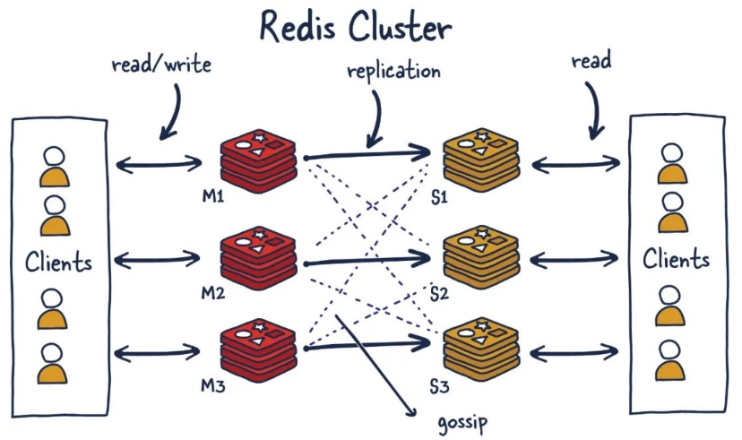

Redis 集群是一个提供在多个Redis节点间共享数据的程序集，Redis 集群可以支持多个 Master。Redis 集群有以下特性

* Redis 集群支持多个 Master，每个 Master 又可以挂载多个 Slave。也就意味着读写分离，支持数据的高可用，支持海量数据的读写存储操作。
* 由于 Cluster 自带 Sentinel 的故障转移机制，内置了高可用的支持，无需再去使用哨兵功能
* 客户端与 Redis 的节点连接，不再需要连接集群中所有的节点，只需要任意连接集群中的一个可用节点即可
* 槽位 slot 负责分配到各个物理服务节点，由对应的集群来负责维护节点、插槽和数据之间的关系

=== 配置

<<redis-conf-cluster>>

=== 集群算法

==== 槽位

Redis 集群没有使用一致性 hash 算法，而是引入了哈希槽的概念。

Redis 集群有 16384 个哈希槽，每个 key 通过 CRC16 校验后对 16484 取模来决定放置那个槽，集群的每个节点负责一部分 hash 槽。

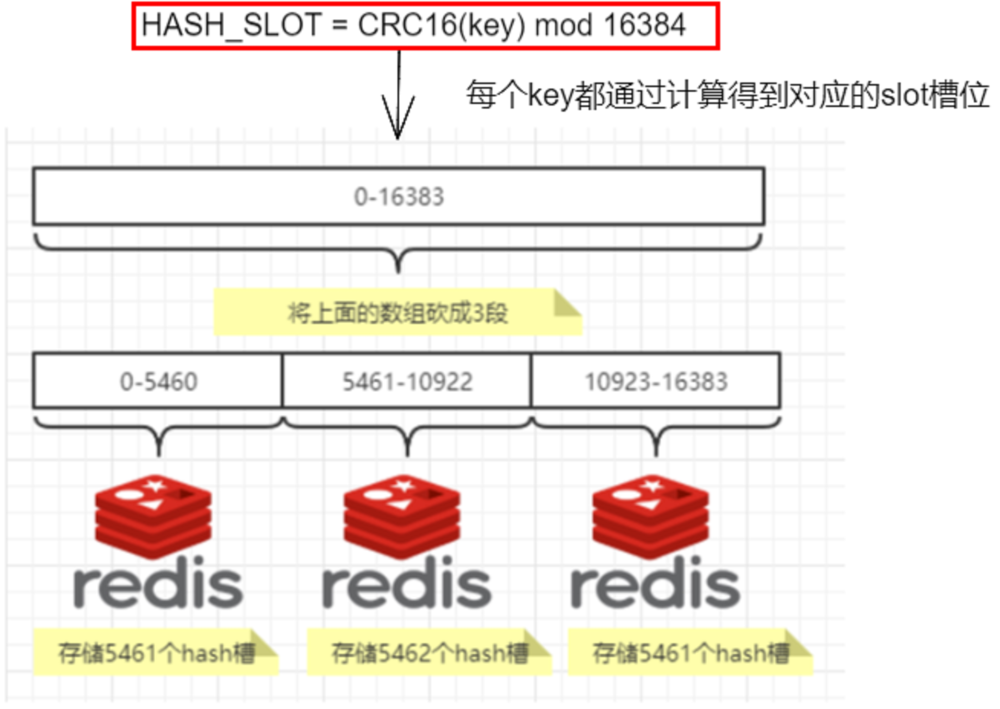

IMPORTANT:: Redis 的槽位有 16384 个，建议节点数量小于等于 1000

==== 分片

什么是分片？使用 Redis 集群时我们会将存储的数据分散到多台 redis 机器上，这称为分片。简言之，集群中的每个 Redis 实例都被认为是整个数据的一个分片。

如何找到给定的 key 的分片？为了找到给定 key 的分片，我们对 key 进行 `CRC16(key)` 算法处理并通过对总分片数量取模。然后，使用确定性哈希函数，这意味着给定的 key 将多次始终映射到同一个分片，我们可以推断将来读取特定 key 的位置。

最大优势，方便扩缩容和数据分派查找，这种结构很容易添加或者删除节点 ，比如我增一个节点 D，只需要从节点 A，B ,C 中得到部分槽到 D 上即可，
如果移除一个节点 A，则将这个 A 节点中的槽移到 B，C 节点上，然后将没有任何槽的 A 节点从集群中删除即可。

由于从一个节点将哈希槽移动到另一个节点并不会停止服务，所有无论添加删除或者改变某个节点的哈希槽都不会造成集群不可用状态。

==== 分区映射

===== 哈希取余分区

`hash(key) % N` 个机器台数，计算出哈希值，用来决定数据映射到哪一个节点上。

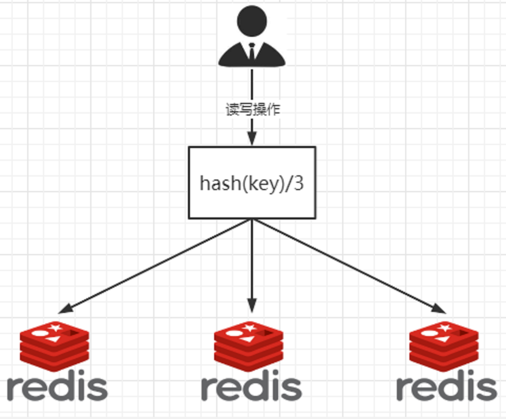

===== 一致性哈希算法

一致性哈希算法必然有个 hash 函数并按照算法产生 hash 值，这个算法的所有可能哈希值会构成一个全量集，这个集合可以成为一个 hash 空间 `[0,2^32-1]`，这个是一个线性空间，但是在算法中，
我们通过适当的逻辑控制将它首尾相连 (0 = 2^32),这样让它逻辑上形成了一个环形空间。

它也是按照使用取模的方法，前面笔记介绍的节点取模法是对节点（服务器）的数量进行取模。而一致性 Hash 算法是对 `2^32` 取模，简单来说，一致性 Hash 算法将整个哈希值空间组织成一个虚拟的圆环，
如假设某哈希函数 H 的值空间为 `0-2^32-1`（即哈希值是一个 32 位无符号整形），整个哈希环如下图：整个空间按顺时针方向组织，圆环的正上方的点代表 0，0 点右侧的第一个点代表 1，以此类推，2、3、4、……直到 2^32-1，
也就是说 0 点左侧的第一个点代表 `2^32-1`， 0 和 `2^32-1` 在零点中方向重合，我们把这个由 `2^32` 个点组成的圆环称为 Hash 环。

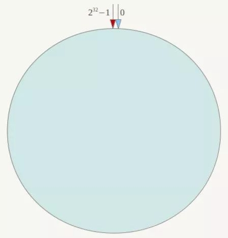

节点映射，将集群中各个 IP 节点映射到环上的某一个位置。 将各个服务器使用 Hash 进行一个哈希，具体可以选择服务器的 IP 或主机名作为关键字进行哈希，这样每台机器就能确定其在哈希环上的位置。假如 4 个节点 NodeA、B、C、D，经过 IP 地址的哈希函数计算(hash(ip))， 使用 IP 地址哈希后在环空间的位置如下：

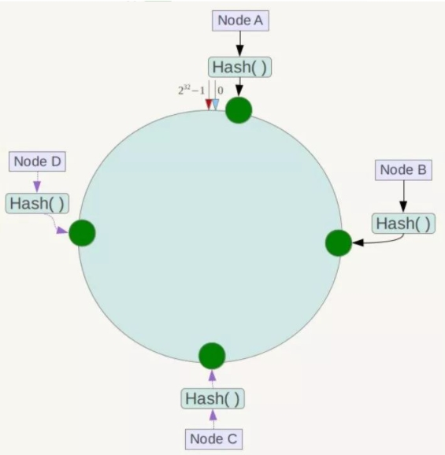

key 落键规则：当我们需要存储一个 kv 键值对时，首先计算 key 的 hash 值，`hash(key)`，将这个 key 使用相同的 Hash 函数计算出哈希值并确定此数据在环上的位置，从此位置沿环顺时针 **行走**，第一台遇到的服务器就是其应该定位到的服务器，并将该键值对存储在该节点上。

如我们有 `Object A、Object B、Object C、Object D` 四个数据对象，经过哈希计算后，在环空间上的位置如下：根据一致性 Hash 算法，数据 A 会被定为到 Node A 上，B 被定为到 Node B 上，C 被定为到 Node C 上，D 被定为到 Node D 上。

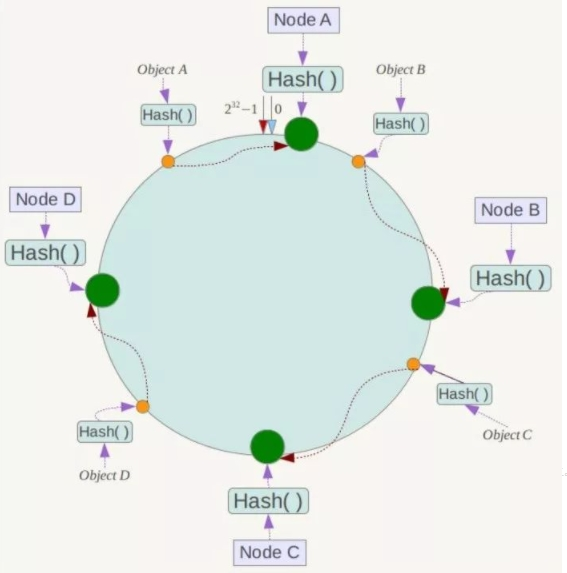

一致性哈希算法的容错性：假设 Node C 宕机，可以看到此时对象 A、B、D 不会受到影响。一般的，在一致性 Hash 算法中，如果一台服务器不可用，则受影响的数据仅仅是此服务器到其环空间中前一台服务器（即沿着逆时针方向行走遇到的第一台服务器）之间数据，其它不会受到影响。简单说，就是 C 挂了，受到影响的只是 B、C 之间的数据且这些数据会转移到 D 进行存储。

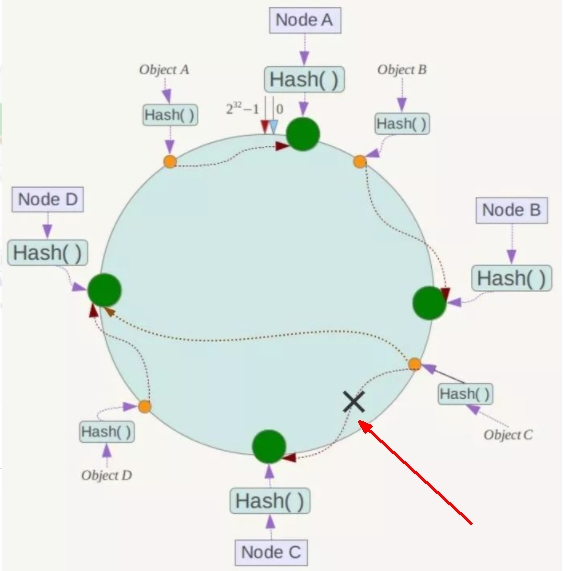

一致性哈希算法的扩展性：数据量增加了，需要增加一台节点 Node X，X 的位置在 A 和 B 之间，那收到影响的也就是 A 到 X 之间的数据，重新把A到X的数据录入到 X 上即可， 不会导致 hash 取余全部数据重新洗牌。

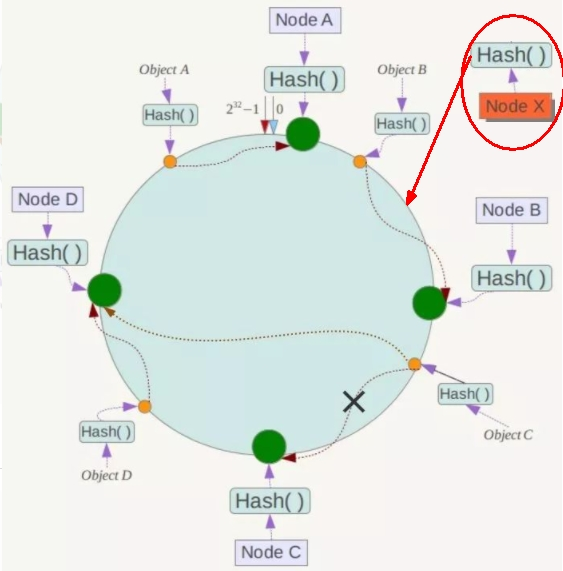

Hash 环的数据倾斜问题：一致性 Hash 算法在服务节点太少时，容易因为节点分布不均匀而造成数据倾斜（被缓存的对象大部分集中缓存在某一台服务器上）问题， 例如系统中只有两台服务器：

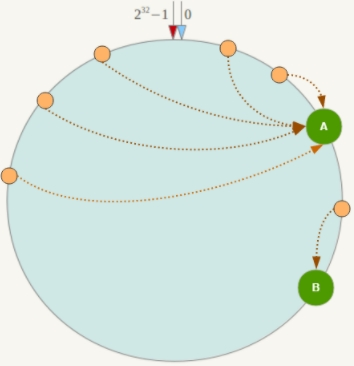

===== 哈希槽分区

为了解决均匀分配的问题，在数据和节点之间又加入了一层，把这层称为哈希槽（slot），用于管理数据和节点之间的关系，现在就相当于节点上放的是槽，槽里放的是数据。

哈希槽实质就是一个数组，数组 `[0,2^14 -1]` 形成 hash slot 空间。

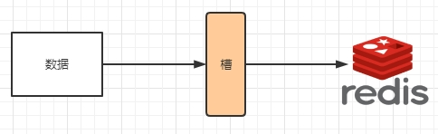

一个集群只能有 16384 个槽，编号 `0-16383（0-2^14-1）`。这些槽会分配给集群中的所有主节点，分配策略没有要求。

集群会记录节点和槽的对应关系，解决了节点和槽的关系后，接下来就需要对 key 求哈希值，然后对 16384 取模，余数是几 key 就落入对应的槽里。`HASH_SLOT = CRC16(key) mod 16384`。以槽为单位移动数据，因为槽的数目是固定的，处理起来比较容易，这样数据移动问题就解决了。

==== 为什么 redis 集群的最大槽数是 16384 个？

CRC16 算法产生的 hash 值有 16bit，该算法可以产生 `2^16=65536` 个值。 换句话说值是分布在 `0~65535` 之间，有更大的 `65536` 不用为什么只用 `16384` 就够？
作者在做 mod 运算的时候，为什么不 mod65536，而选择 `mod16384`？  HASH_SLOT = CRC16(key) mod 65536 为什么没启用

作者的详细回答可查看：https://github.com/redis/redis/issues/2576

翻译：

* 正常的心跳数据包带有节点的完整配置，可以用幂等方式用旧的节点替换旧节点，以便更新旧的配置。这意味着它们包含原始节点的插槽配置，该节点使用 `2k` 的空间和 `16k` 的插槽，但是会使用 `8k` 的空间（使用 `65k` 的插槽）。
* 同时，由于其他设计折衷，Redis 集群不太可能扩展到 1000 个以上的主节点。

因此 `16k` 处于正确的范围内，以确保每个主机具有足够的插槽，最多可容纳 1000 个矩阵，但数量足够少，可以轻松地将插槽配置作为原始位图传播。请注意，在小型群集中，位图将难以压缩，因为当 N 较小时，位图将设置的 `slot/N` 位占设置位的很大百分比。

解释：

* 如果槽位为 65536，发送心跳信息的消息头达 8k，发送的心跳包过于庞大。
+
在消息头中最占空间的是 `myslots[CLUSTER_SLOTS/8]`。 当槽位为 65536 时，这块的大小是: `65536÷8÷1024=8kb`
+
在消息头中最占空间的是 `myslots[CLUSTER_SLOTS/8]`。 当槽位为 16384 时，这块的大小是: `16384÷8÷1024=2kb`
+
因为每秒钟，redis 节点需要发送一定数量的 ping 消息作为心跳包，如果槽位为 65536，这个 ping 消息的消息头太大了，浪费带宽。

* redis 的集群主节点数量基本不可能超过 1000 个。
+
集群节点越多，心跳包的消息体内携带的数据越多。如果节点过 1000 个，也会导致网络拥堵。因此 redis 作者不建议 redis cluster 节点数量超过 1000 个。
那么，对于节点数在 1000 以内的 redis cluster 集群，16384 个槽位够用了。没有必要拓展到 65536 个。

* 槽位越小，节点少的情况下，压缩比高，容易传输
+
Redis 主节点的配置信息中它所负责的哈希槽是通过一张 bitmap 的形式来保存的，在传输过程中会对 bitmap 进行压缩，但是如果 bitmap 的填充率 slots/N 很高的话(N 表示节点数)，bitmap 的压缩率就很低。
如果节点数很少，而哈希槽数量很多的话，bitmap 的压缩率就很低。

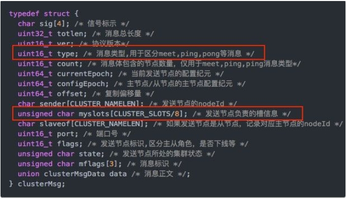

===== 优缺点

. 各类方式的优缺点
|===
|  |优点 |缺点

| 哈希取余分区
| 简单粗暴，直接有效，只需要预估好数据规划好节点，例如 3 台、8 台、10 台，就能保证一段时间的数据支撑。使用 Hash 算法让固定的一部分请求落到同一台服务器上，
这样每台服务器固定处理一部分请求（并维护这些请求的信息），起到负载均衡+分而治之的作用。
| 原来规划好的节点，进行扩容或者缩容就比较麻烦了额，不管扩缩，每次数据变动导致节点有变动，映射关系需要重新进行计算，在服务器个数固定不变时没有问题，
如果需要弹性扩容或故障停机的情况下，原来的取模公式就会发生变化：`Hash(key)/3` 会变成 `Hash(key) /?`。此时地址经过取余运算的结果将发生很大变化，根据公式获取的服务器也会变得不可控。
某个 redis 机器宕机了，由于台数数量变化，会导致 hash 取余全部数据重新洗牌。

| 一致性哈希算法
| 加入和删除节点只影响哈希环中顺时针方向的相邻的节点，对其他节点无影响。
| 数据的分布和节点的位置有关，因为这些节点不是均匀的分布在哈希环上的，所以数据在进行存储时达不到均匀分布的效果。

| 哈希槽分区
|
|
|===

NOTE:: Redis 集群不保证强一致性，这意味着在特定的条件下，Redis 集群可能会丢掉一些被系统收到的写入请求命令

=== 相关命令

* redis-cli -a password --cluster create --cluster-replicas 1 ....ip：构建主从关系。`--cluster-replicas` 1 表示为每个 master 创建一个 slave 节点
* redis-cli -a password --cluster add-node 172.31.110.12:6379 172.31.110.15:6479：向集群中添加节点。172.31.110.12:6379 为要添加的节点，172.31.110.15:6479 为集群中的任意节点
* redis-cli -a password --cluster add-node --cluster-slave --cluster-master-id 7b9707e3d2e52863ab4b9228a0c4b309f81ac790 172.31.110.12:6379 172.31.110.15:6479：添加从节点。7b9707e3d2e52863ab4b9228a0c4b309f81ac790 为主节点的 ID，
172.31.110.12:6379 为要添加的节点， 172.31.110.15:6479 为集群中的任意节点
* redis-cli -a password --cluster reshard 172.31.110.15:6479：重新分配槽号。172.31.110.15:6479 为集群中的任意节点
* redis-cli -a password --cluster del-node 172.31.110.15:6479 f8c04e53a74a1fe4b67bfa44eda2dc40d13c9722：f8c04e53a74a1fe4b67bfa44eda2dc40d13c9722 为节点的 ID，172.31.110.15:6479 为要删除的节点
* cluster info : 查看当前节点集群信息
* cluster nodes：集群节点信息
* cluster keyslot key： 查看某个 key 的槽位值
* CLUSTER COUNTKEYSINSLOT 槽位数字编号：1，该槽位被占用，0，该槽位没占用
* CLUSTER KEYSLOT 键名称：该键应该存在哪个槽位上

=== 注意事项

* Redis 集群读写的时候一定注意槽位的范围区间。在命令行上防止路由失效加参数 `-c` 参数
* 集群的中的某个主节点突然挂掉后，其从机会自动上位成为 master，类似哨兵机制。当挂掉的节点恢复后，不会上位，而是以从节点的形式回归。如果我们需要调整其主从关系，可以进入到相关节点，使用 `CLUSTER FAILOVER` 命令
* 集群在扩容和缩容后，需要重新分派槽位
* 集群扩容：在重新分派槽号后，使用均匀分配，即从其他节点各自分一些出来给新加入的节点
* 不在同一个 slot 槽位下的键值无法使用 `mset`、`mget` 等多键操作。可以通过 `{}` 来定义同一个组的概念，使 key 中 `{}` 内相同内容的键值对放到一个 slot 槽位去，对照下图类似 k1 k2 k3 都映射为 x，自然槽位一样
+
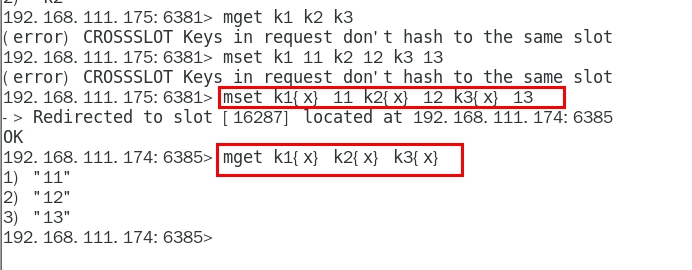