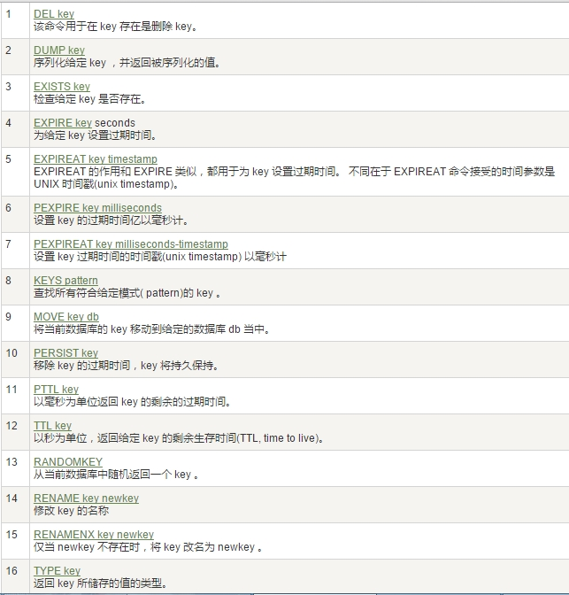

[[redis-data-type]]
== Redis 的十大数据类型

我们可以在 https://redis.io/commands/[官网英文] 或 http://www.redis.cn/commands.html[中文] 获取 redis 常见数据类型操作命令。数据类型一览：

* <<redis-data-type-string>>
* <<redis-data-type-list>>
* <<redis-data-type-hash>>
* <<redis-data-type-set>>
* <<redis-data-type-zset>>
* <<redis-data-type-geo>>
* <<redis-data-type-hyperloglog>>
* <<redis-data-type-bitmap>>
* <<redis-data-type-bitfield>>
* <<redis-data-type-stream>>

[[redis-data-type-string]]
=== String

* string 是 redis 最基本的类型,你可以理解成与 Memcached 一模一样的类型,一个 key 对应一个 value.
* string 类型是二进制安全的.意思是 redis 的 string 可以包含任何数据.比如 jpg 图片或者序列化的对象 .
* string 类型是 Redis 最基本的数据类型,一个 redis 中字符串 value 最多可以是 `512M`

[[redis-data-type-list]]
=== list

* Redis 列表是简单的字符串列表,按照插入顺序排序.你可以添加一个元素导列表的头部(左边)或者尾部(右边).
* 它的底层实际是个双端链表，最多可以包含 2^32 - 1 个元素 (4294967295, 每个列表超过40亿个元素).

[[redis-data-type-hash]]
=== hash

* Redis hash 是一个键值对集合.
* Redis hash 是一个 string 类型的 field 和 value 的映射表,hash 特别适合用于存储对象.
* Redis 中每个 hash 可以存储 2^32 - 1 键值对（40多亿）
* 类似 Java 里面的 `Map<String,Object>`

[[redis-data-type-set]]
=== set

* Redis 的 Set 是 String 类型的无序集合。集合成员是唯一的，这就意味着集合中不能出现重复的数据，集合对象的编码可以是 intset 或者 hashtable。
* Redis 中 Set 集合是通过哈希表实现的，所以添加，删除，查找的复杂度都是 O(1)。
* 集合中最大的成员数为 2^32 - 1 (4294967295, 每个集合可存储40多亿个成员)

[[redis-data-type-zset]]
=== zset(sorted set: 有序集合)

* Redis zset 和 set 一样也是 string 类型元素的集合,且不允许重复的成员。 不同的是每个元素都会关联一个 double 类型的分数，redis 正是通过分数来为集合中的成员进行从小到大的排序。
* zset 的成员是唯一的,但分数(score)却可以重复。
* zset 集合是通过哈希表实现的，所以添加，删除，查找的复杂度都是 O(1)。 集合中最大的成员数为 2^32 - 1

[[redis-data-type-geo]]
=== GEO

* Redis GEO 主要用于存储地理位置信息，并对存储的信息进行操作，包括
** 添加地理位置的坐标。
** 获取地理位置的坐标。
** 计算两个位置之间的距离。
** 根据用户给定的经纬度坐标来获取指定范围内的地理位置集合

[[redis-data-type-hyperloglog]]
=== HyperLogLog

* HyperLogLog 是用来做基数统计的算法，HyperLogLog 的优点是，在输入元素的数量或者体积非常非常大时，计算基数所需的空间总是固定且是很小的。
* 在 Redis 里面，每个 HyperLogLog 键只需要花费 12 KB 内存，就可以计算接近 2^64 个不同元素的基 数。这和计算基数时，元素越多耗费内存就越多的集合形成鲜明对比。
* 但是，因为 HyperLogLog 只会根据输入元素来计算基数，而不会储存输入元素本身，所以 HyperLogLog 不能像集合那样，返回输入的各个元素。

[[redis-data-type-bitmap]]
=== bitmap

image::../img/redis04.jpeg[]

* 由 0 和 1 状态表现的二进制位的 bit 数组

[[redis-data-type-bitfield]]
=== bitfield

* 通过 bitfield 命令可以一次性操作多个比特位域(指的是连续的多个比特位)，它会执行一系列操作并返回一个响应数组，这个数组中的元素对应参数列表中的相应操作的执行结果。
* 说白了就是通过 bitfield 命令我们可以一次性对多个比特位域进行操作。

[[redis-data-type-stream]]
=== Stream

* Redis Stream 是 Redis 5.0 版本新增加的数据结构。
* Redis Stream 主要用于消息队列（MQ，Message Queue），Redis 本身是有一个 Redis 发布订阅 (pub/sub) 来实现消息队列的功能，但它有个缺点就是消息无法持久化，如果出现网络断开、Redis 宕机等，消息就会被丢弃。
* 简单来说发布订阅 (pub/sub) 可以分发消息，但无法记录历史消息。
* 而 Redis Stream 提供了消息的持久化和主备复制功能，可以让任何客户端访问任何时刻的数据，并且能记住每一个客户端的访问位置，还能保证消息不丢失

[[redis-command]]
== Redis 常用命令

* redis-benchmark  redis 性能测试
* redis 默认安装了 `16` 个库,角标是 [0-15],默认数据库为 0. `select` 命令切换数据库
* set key value:设置键值对
* keys *: 显示当前库的所有 `key`
* exists key: 判断某个key是否存在
* dbsize: 查看当前数据库的 `key` 的数量
* type key: 查看你的 key 是什么类型
* get key:获取 key 的值
* del key:删除 ket
* unlink key: 非阻塞删除，仅仅将keys从keyspace元数据中删除，真正的删除会在后续异步中操作。
* ttl key: 查看还有多少秒过期，`-1` 表示永不过期，`-2` 表示已过期
* expire key 秒钟: 为给定的 key 设置过期时间
* move key dbindex【0-15】：将当前数据库的 key 移动到给定的数据库 db 当中
* select dbindex：切换数据库【0-15】，默认为0
* mset key1 value1 ...:同时设置一个或多个键值对
* mget key1 ...: 同时获取多个键值对
* setex key second value: 设置 key 的过期时间和值
* flushdb：删除当前库.
* flushall：删除所有库
* https://redis.io/commands/[Redis 常用命令] 或 http://www.redis.cn/commands.html[Redis 常用命令（中文）]

NOTE:: 命令不区分大小写，而 key 是区分大小写的. 永远的帮助命令，`help @类型`，例如 `help @string`，`help @list`，`help @hash`，`help @hyperloglog`.
