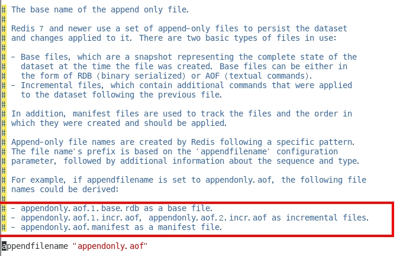

[[redis-persistence]]
== Redis 的持久化

[[redis-persistence-rdb]]
=== RDB（Redis DataBase）

RDB（Redis Database）：RDB 持久性以指定的时间间隔执行数据集的时间点快照。实现类似照片记录效果的方式，就是把某一时刻的数据和状态以文件的形式写到磁盘上，也就是快照。这样一来即使故障宕机，快照文件也不会丢失，数据的可靠性也就得到了保证。
这个快照文件就称为 RDB 文件(`dump.rdb`)。

* 在指定的时间间隔内将内存中的数据集快照写入磁盘, 也就是行话讲的 Snapshot 快照,它恢复时是将快照文件直接读到内存里
* Redis 会单独创建(fork)一个子进程来进行持久化,会先将数据写入到 一个临时文件中,待持久化过程都结束了,再用这个临时文件替换上次持久化好的文件. 整个过程中,主进程是不进行任何 IO 操作的,这就确保了极高的性能.
* Redis的数据都在内存中，保存备份时它执行的是 **全量快照**， 也就是说，把内存中的所有数据都记录到磁盘中，如果需要进行大规模数据的恢复,且对于数据恢复的完整性不是非常敏感,那 RDB 方式要比 AOF 方式更加的高效.RDB 的缺点是最后一次持久化后的数据可能丢失.
* fork 的作用是复制一个与当前进程一样的进程.新进程的所有数据(变量、环境变量、程序计数器等) 数值都和原进程一致,但是是一个全新的进程,并作为原进程的子进程.

====  文件

rdb 保存的是 dump.rdb 文件

====  配置

redis 的配置文件中的 SNAPSHOTTING 快照配置.详情参照 <<redis-conf-snapshotting>>

====  如何触发 RDB 快照

===== 自动触发

* redis 的配置文件中的 SNAPSHOTTING 快照配置.详情参照 <<redis-conf-snapshotting>>

===== NOTE:: 不可以把备份文件 `dump.rdb` 和生产 redis 服务器放在同一台机器，必须分开各自存储， 以防生产机物理损坏后备份文件也挂了。

手动触发：通过 `save` 和 `bgsave` 命令

* save: 在主程序中执⾏会阻塞当前 redis 服务器，直到持久化工作完成 执行 save 命令期间，Redis 不能处理其他命令，**线上禁止使用**
* bgsave: Redis 会在后台异步进行快照操作,快照同时还可以响应客户端请求.可以通过 `lastsave`.命令获取最后一次成功执行快照的时间.

===== `flushall`/`flushdb`

* 执行 `flushall`/`flushdb` 命令,也会产生 `dump.rdb` 文件,但里面是空的,无意义.

===== 执行 shutdown 且没有设置开启 AOF 持久化

===== 主从复制时，主节点自动触发

NOTE:: Redis 默认采用 BGSAVE 的方式

==== 恢复数据

将备份文件 (dump.rdb) 移动到 redis 安装目录并启动服务即可。CONFIG GET dir 获取目录.

====  优势

* 适合大规模的数据恢复.
* 按照业务定时备份
* 对数据完整性和一致性要求不高.
* RDB 文件在内存中的加载速度要比 AOF 快得多

====  劣势

* 在一定间隔时间做一次备份,所以如果 redis 意外 down 掉的话,就会丢失最后一次快照后的所有修改.
* 内存数据的全量同步，如果数据量太大会导致 I/0 严重影响服务器性能
* RDB依赖于主进程的 fork，在更大的数据集中，这可能会导致服务请求的瞬间延迟。 fork 的时候内存中的数据被克隆了一份，大致 2 倍的膨胀性，需要考虑

====  停止

动态所有停止 RDB 保存规则的方法: redis-cli config set save ""

快照禁用: 通过配置文件

==== 总结

[[redis-persistence-aof]]
=== AOF（Append Only File）

以日志的形式来记录每个写操作，将Redis执行过的所有写指令记录下来(读操作不记录)， 只许追加文件但不可以改写文件，redis 启动之初会读取该文件重新构建数据，换言之，redis
重启的话就根据日志文件的内容将写指令从前到后执行一次以完成数据的恢复工作。

默认情况下，redis 是没有开启 AOF(append only file) 的。 开启 AOF 功能需要设置配置：`appendonly yes`

AOF 保存的是 `appendonly.aof` 文件

==== 配置

详情参考 <<redis-conf-appendonlymode>>

* AOF 文件-保存路径:
+
Redis 6 之前：AOF 保存文件的位置和 RDB 保存文件的位置一样， 都是通过 `redis.conf` 配置文件的 `dir` 配置
+
Redis 7 之后添加 `appenddirname` 配置。最终路径为 `dir + appenddirname`
+

* AOF 文件 - 保存名称
+
Redis 6 之前,有且只有一个文件。
+
Redis 7 新增 Multi Part AOF 的设计。
+

+

==== 工作流程

. Client 作为命令的来源，会有多个源头以及源源不断的请求命令。
. 在这些命令到达 Redis Server 以后并不是直接写入 AOF 文件，会将其这些命令先放入 AOF 缓存中进行保存。这里的 AOF 缓冲区实际上是内存中的一片区域，
存在的目的是当这些命令达到一定量以后再写入磁盘，避免频繁的磁盘 IO 操作。
. AOF 缓冲会根据 AOF 缓冲区同步文件的三种写回策略将命令写入磁盘上的 AOF 文件。
. 随着写入 AOF 内容的增加为避免文件膨胀，会根据规则进行命令的合并(又称 AOF 重写)，从而起到 AOF 文件压缩的目的。
. 当 Redis Server 服务器重启的时候会从 AOF 文件载入数据。

三种写回策略（appendfsync）：

* always：同步写回，每个写命令执行完立刻同步地将日志写回磁盘
* everysec（默认）：每秒写回，每个写命令执行完，只是先把日志写到 AOF 文件的内存缓冲区，每隔 1 秒把缓冲区中的内容写入磁盘
* no：操作系统控制的写回，每个写命令执行完，只是先把日志写到AOF文件的内存缓冲区，由操作系统决定何时将缓冲区内容写回磁盘

==== 恢复

正常恢复：启用 AOF，修改默认的 `appendonly no`，改为 `yes`。 当写入数据时，会自动生产 `aof` 文件，Redis 在启动时会自动加载

异常恢复：可以使用 `redis-check-aof --fix` 进行修复。然后再进行恢复。

==== 优势

* 更好的保护数据不丢失 、性能高、可做紧急恢复

==== 劣势

* 相同数据集的数据而言 aof 文件要远大于 rdb 文件，恢复速度慢于 rdb
* aof 运行效率要慢于 rdb,每秒同步策略效率较好，不同步效率和 rdb 相同

==== AOF 重写机制

由于 AOF 持久化是 Redis 不断将写命令记录到 AOF 文件中，随着 Redis 不断的进行，AOF 的文件会越来越大， 文件越大，占用服务器内存越大以及 AOF 恢复要求时间越长。

为了解决这个问题，Redis 新增了重写机制，当 AOF 文件的大小超过所设定的峰值时，Redis 就会自动启动 AOF 文件的内容压缩， 只保留可以恢复数据的最小指令集或者可以手动使用命令 `bgrewriteaof` 来重写。

可以通过 `auto-aof-rewrite-percentage` 和 `auto-aof-rewrite-min-size` 配置，也可以使用客户端向服务器发送 `bgrewriteaof` 命令来触发重写机制。

* 重写原理
. 在重写开始前，redis 会创建一个“重写子进程”，这个子进程会读取现有的 AOF 文件，并将其包含的指令进行分析压缩并写入到一个临时文件中。
. 与此同时，主进程会将新接收到的写指令一边累积到内存缓冲区中，一边继续写入到原有的 AOF 文件中，这样做是保证原有的 AOF 文件的可用性，避免在重写过程中出现意外。
. 当“重写子进程”完成重写工作后，它会给父进程发一个信号，父进程收到信号后就会将内存中缓存的写指令追加到新 AOF 文件中
. 当追加结束后，redis 就会用新 AOF 文件来代替旧 AOF 文件，之后再有新的写指令，就都会追加到新的 AOF 文件中
. 重写 AOF 文件的操作，并没有读取旧的 AOF 文件，而是将整个内存中的数据库内容用命令的方式重写了一个新的 AOF 文件，这点和快照有点类似

==== 总结

=== RDB-AOF 混合持久化

在同时开启 RDB 和 AOF 持久化时，重启时只会加载 AOF 文件，不会加载 RDB 文件。

1 开启混合方式设置
设置 `aof-use-rdb-preamble` 的值为 `yes`   yes 表示开启，设置为 no 表示禁用
2 RDB+AOF 的混合方式---------> 结论：RDB 镜像做全量持久化，AOF 做增量持久化
先使用 RDB 进行快照存储，然后使用 AOF 持久化记录所有的写操作，当重写策略满足或手动触发重写的时候，将最新的数据存储为新的 RDB 记录。这样的话，
重启服务的时候会从 RDB 和 AOF 两部分恢复数据，既保证了数据完整性，又提高了恢复数据的性能。简单来说：混合持久化方式产生的文件一部分是 RDB 格式，一部分是 AOF 格式。

AOF 包括了 RDB 头部 + AOF 混写

=== 纯缓存模式

同时关闭 RDB+AOF

* 禁用 rdb 持久化模式下，我们仍然可以使用命令 save、bgsave 生成 rdb 文件
* 禁用 aof 持久化模式下，我们仍然可以使用命令 bgrewriteaof 生成 aof 文件